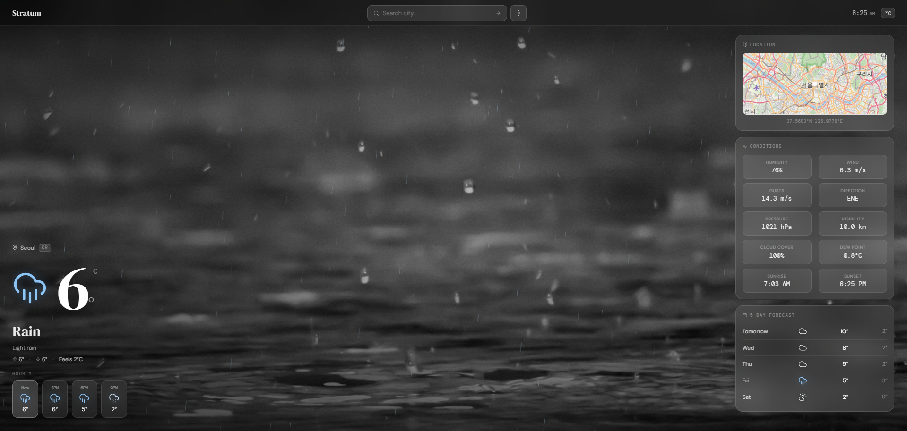
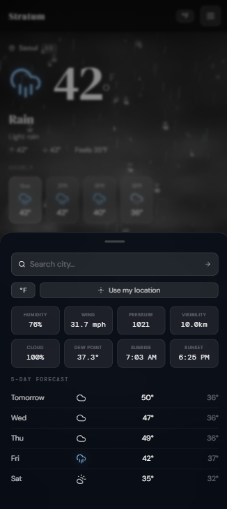

# Stratum 🌤

A minimal, immersive weather web app with real-time data, photo backgrounds, and canvas weather effects.

---

## Features

- **Full-bleed photo backgrounds** — 8 curated Unsplash photos per weather condition, crossfading on each search
- **Canvas weather effects** — animated rain, heavy rain, drizzle, snow, mist, stars (night), and golden dust (clear)
- **Lightning** — random flash events during thunderstorm conditions
- **Lucide icons** — clean stroke-only SVG weather icons that read clearly over any photo
- **Interactive map** — Leaflet.js map that pans to each searched city
- **Rich weather data** — humidity, wind speed & direction, gusts, pressure, visibility, cloud cover, dew point, sunrise, sunset
- **5-day forecast** with high/low temps
- **Hourly strip** showing today's temperatures
- **Auto day/night** — detects local sunrise/sunset at the searched city and switches to night mode automatically
- **°C / °F toggle**
- **GPS location** — use your current location
- **Random boot city** — loads a world city on startup so the page is never empty
- **Mobile-first bottom sheet** — swipe up, tap hamburger, or use the search bar inside

---

## API

Uses [OpenWeatherMap](https://openweathermap.org/api) free tier:
- `GET /data/2.5/weather` — current conditions
- `GET /data/2.5/forecast` — 5-day / 3-hour forecast

---

## Photo Credits

Background photos sourced from [Unsplash](https://unsplash.com). Unsplash grants a free license for use in apps and websites. Full attribution at [unsplash.com/license](https://unsplash.com/license).

---

## Roadmap Ideas

- [ ] Save favourite cities
- [ ] Air quality index (AQI) panel
- [ ] UV index
- [ ] Radar map overlay
- [ ] PWA / offline support
- [ ] Dark tint intensity slider for photos

---

## Images

*1. Desktop*

*2. Phone*

